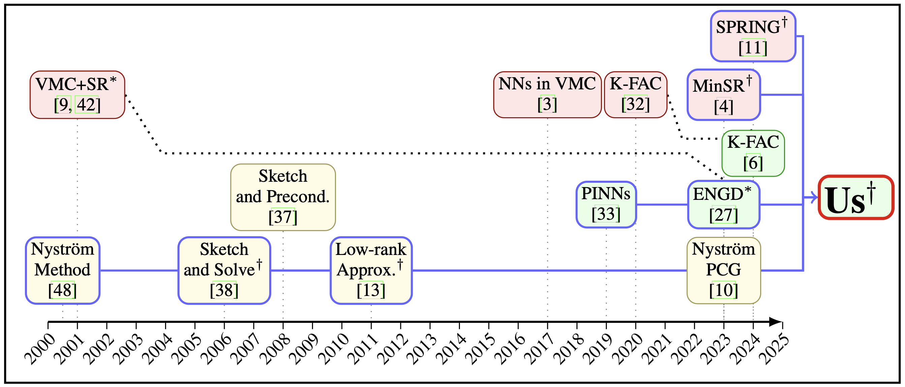

# Improving Energy Natural Gradient Descent through Woodbury, Momentum, and Randomization

<p align="center">
  <!-- <a href="https://github.com/andresguzco/ef-vfm/blob/main/LICENSE"> -->
  <!--    -->
  <!-- </a> -->
  <!-- <a href="https://openreview.net/pdf?id=kjtvCSkSsy"> -->
  <!--    -->
  <!-- </a> -->
  <a href="https://arxiv.org/abs/2505.12149">
    
  </a>
</p>

<div align="center">
  
  <p><em> Figure 1: Timeline of VMC, PINN and RLA methods. Stochastic reconfiguration (SR) and energy natural gradient descent (ENGD) both precondition their stochastic gradients with the inverse of an appropriate curvature matrix. †: Inspired by MinSR, we apply Woodbury’s matrix identity to use the kernel matrix instead of ENGD’s Gauss-Newton matrix, thus reducing the cost to $O(N^2P)$ instead of $O(P^3)$, where N denotes the batch size and P the number of parameters; we further introduce SPRING for PINNs to transport curvature information across optimization steps; last, we use a GPU-efficient Nystr\"om approximation to reduce the iteration cost for large batch sizes.</a></em></p>
</div>

## Latest Update

- [2025.09]：Releasing our codebase.

## Introduction

[Description to be added.]

The schema of EF-VFM is presented in the figure above. For more details, please refer to [our paper](https://arxiv.org/abs/2505.12149).

## Developer guide

This guide describes principles and workflows for developers.

### Setup

We recommend programming in a fresh virtual environment. 
You can set up the `conda` environment and activate it

```bash
make conda-env
conda activate rla_pinns
```

If you don't use `conda`, set up your preferred environment and run

```bash
pip install -e ."[lint,test]"
```
to install the package in editable mode, along with all required development dependencies
(the quotes are for OS compatibility, see
[here](https://github.com/mu-editor/mu/issues/852#issuecomment-498759372)).

### Continuous integration

To standardize code style and enforce high quality, checks are carried out with Github actions when you push. 
You can also run them locally, as they are managed via `make`:

- Run tests with `make test`

- Run all linters with `make lint`, or separately with:

    - Run auto-formatting and import sorting with `make black` and `make isort`

    - Run linting with `make flake8`

    - Run docstring checks with `make pydocstyle-check` and `make darglint-check`

## #Documentation

We use the [Google docstring convention](https://sphinxcontrib-napoleon.readthedocs.io/en/latest/example_google.html) and `mkdocs` which allows using markdown syntax in a docstring to achieve formatting.

